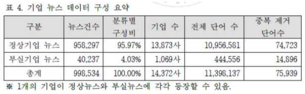

## 논문 정리

##### IT투자와 기업성과 사이의 연관성을 고려한 정보화신용평가모형에 대한 연구 (2004.06)

* IT투자와 연결되는 정보화수준과 기업성과와 연결되는 신용수준 사이에 간접적인 비교 분석
  * IT투자와 기업성과 사이에 어떠한 연관성이 있는 지를 알아보고자 하는 것
* 정보화신용평가지표에 대해 델파 이 기법 및 SPSS를 이용한 신뢰성분석 및 요인분석을 통해 평가지표의 타당성을 검증
* 정보화수준과 신용수준 간의 연관성 분석과 IT투자와 기업성과 사이에 기존 문헌으로부터 정보화특성을 고려한 신용평가영역 및 평가지표를 도출

---------

##### 회계이익과 세무이익의 차이가 기업의 신용등급 평가에 미치는 영향 (2012.12)

* 신용평가 기관이 기업의 신용을 평가함에 있어 회계이익과 세무이익의 차이와 관련된 정보를 고려하는지를 검증
  * 검증결과 : 회계이익과 세무이익의 차이는 차기 기업의 신용등급 평가에 __음(-)의 상관관계__를 보임
    * 신용평가 기관은 회계이익과 세무이익의 차이가 큰 경우 이익지속성을 낮게 평가하며 신용등급에 부정적 영향을 미침
    * 신용평가 기관은 회계이익이 세무이익보다 크게 나타나는 경우, 회계이익과 세무이익의 차이가 경영자의 이익조정과 관련되었을 가능성이 높다고 판단
    * 신용평가 기관은 피 평가기업이 이익조정이 의심되는 기업일 경우, 회계이익과 세무이익의 차이를 보다 크게 반영한다.

---------

##### 기업의 사회적 책임이 신용등급과 자본비용에 미치는 영향 (2017.01)

  * 우수한 기업의 사회적 책임 활동이 신용등급 결정에 중 요한 요소로 작용하는가를 검증
    * 검증결과 : 기업의 사회적 책임활동은 신용등급과 유의한 __양(+)의 영향__을 미치는 것을 보임
      * 신용평가기관의 신용등급 평가시 우수한 기업의 사회 책임 활동이 중요한 정보로 반영되고 있음을 의미
  * 자본시장에서 우수한 기업의 사회적 책 임활동이 자본비용을 감소시키는 유인인지를 검증
    * 검증결과 : 기업의 사회적 책임활동이 자본비용과 유의한 __음(-)의 영향__을 미치는 것 을 보임
      * 기업이 ESG 평가등급을 높을수록 자본시장에서 긍정적으 로 평가를 받아 부담하는 자본비용을 절감시키고 있음을 의미

---------
##### 주요 재무변수와 그 변화율을 이용한 기업신용평가 예측모델(기존 발표에 참조되었던 논문, 2015.12)

* 기업신용평가에 필요한 변수로 중요한 재무정보와 이들의 연도별 변화율을변수로 선정한 후, decision tree, naïve bayesian, random forest 등의 다양한 마이닝 알고리즘을 적용하여 신용평가모델을 구축
  * 검증결과 : 재무정보들의 변화율이 평가에 긍정적인 영향을 미치는 것으로 확인

---------
##### 코스닥 기업의 이익특성이 신용평가에 미치는 영향 (2011.08)

* 코스닥기업의 이익특성과 신용평가의 설명관계를 살펴보고자 한다.
  * 이익특성 : 순이익과, 이익의 구성요소로써 현금흐름과 발생항목, 이익관리, 보고이익의 비정상성

---------
##### 결측이 있는 신용평가 자료의 희소사건 로지스틱 회귀분석 (2017.02)

* 본 연구에서는 결측치를 대체한 후 희소사건에 따른 편의를 보정한 로지스틱 회귀분석 방법의 유효성검증을 위한 모의실험을 실시

* 기업이나 개인의 파산여부 자료는 일반적인 통계기법으로 다루기 힘든 두 가지 특징을 가지고 있다.
  1. 파산은 쉽게 일어나지 않는 희소사건이다.
     * 파산여부 예측모형의 종속변수가 희소사건인 경우 일반적인 로지스틱 회귀분석을 사용하면 회귀계수 추정량에 편향(bias)이 발생하며 사건발생확률을 과소추정 하는 문제점이 있다
  2. 파산여부 자료에서 특정 개인이나 기업의 내부정보 접근성 문제, 자료 수집자(개인이나 회 사 혹은 기관)들의 상이한 수집방식 등의 이유로 결측이 흔히 발생할 수 있다.
     * 결측치를 제거하는 방법보다는 단일대체, 다중대체 방법을 이용하여 결측치를 메꾸는 방법을 주로 사용.

---------
##### 순위로짓모형을 활용한 회사채 신용평가 등급예측모형 개발 (2006.04) 

##### -> 다중공선성 처리가 흥미로워 참고용으로만..

* 다중공선성 처리
  * 기존 연구 : 주성분분석 이용.
    * 비판점 : 변수들 간의 상관관계를 제거하고 추정의 효율성을 높여 부실예측력을 높일 수는 있으나, 실제 해당 기업의 부실 사유를 구체적으로 분석하기에는 한계가 있다.
  * 본 연구 : 요인분석을 통해 몇 개의 요인으로 구분한 후, 분류된 각각의 요인에서 유의한 변수를 하나씩 선정하였다. (+ varimax 회전) - 총 9개 요인.

---------
##### 재무건전성지수를 이용한 신용등급 예측모형 (2002.08)

* 현금흐름변수와 피오트로스키 교수의 재무건전성지수를 이용하여 신용등급 예측모형을 이론적으로 제시하고자 함.

  -> 누구나 접근할 수 있는 공개된 정보인 기업 재무정보를 이용하여 투자자들이 보다 쉽게 기업의 신용등급을 측정할 수 있을 것.

* _ordered probit_ 모형 이용.

  * 이유 : 종속변수를 신용등급을 수치화하여 사용, 이것은 이산적인 종속변수의 값이 절대적인 크기보다 순서가 중요한 의미를 지니므로

* 모델을 평가할 때 상하 한 등급의 오차를 허용했을 때의 정확도로 측정.

--------
##### 랜덤 포레스트를 활용한 기업채권등급평가 모형(2014) 

* 효과적인 설명변수 선택 불가, 과적합 문제, 잡음 및 이상치에 취약, 모수 조정 필요
  * 랜덤 포레스트 제안
    * 평가 및 비교를 위해 다변량판별분석, 인공신경망, MSVM 모형 적합
    * 예측 정확도를 기준으로 비교
* 데이터
  * 제조업 상장기업 1295개, 2002년 신용등급이 반응 변수
    * A1, A2, A3, B, C -> 1,2,3,4 (B+C)
      * why?) 실제 C 등급에 해당하는 기업들의 수가 적어서 등급 구분에 어려움 , 또한 투자부적격 채권으로 해석하는 기준이 B이기 때문에
  * train : test = 8 : 2
  * 과적합화를 피하기 위해 5-fold CV 수행
  * 설명변수로는 39개의 재무변수 (규모 11개, 수익성 13개, 안정성 8개, 현금흐름 4개, 생산성 3개)

* RF의 당위성와 필요성에 대한 설명

  * 입력 변수 선정으로부터 자유롭다 -> 다변수를 다룰 때 유용할 수 있다.

  * 반응변수가 불균형을 이루는 이항변수일 경우 가장 우수한 예측력을 보인다.

  * 부실 예측(이항)이나 신용 등급 예측(다항) 문제 모두에 동일하게 적용될 수 있다.

    -> 그럼에도 그간 충분히 이루어지지 못했다.

* 모형 적합

  * _RF, MDA, ANN, MSVM_에 적합시킴
    * 반응 변수는 범주가 4개인 범주형 변수 => 다항 모델링

* 모형 평가
  * _RF > MSVM > ANN > MDA_

* 정리
  * RF 모형을 쓸 경우 당위성을 얻을 수는 있을 것으로 보임
  * 딱히 특별한 가설없이 재무비율과 관련된 재무변수만으로 모델링을 시도
  * 또한 투자부적격을 기준으로 이항으로 나누는 것이 아닌 다항으로 나눈 것이 기존에 우리가 했던 방식과 유사, 예측력은 약 70% 정도(train set 에서는 67%)
  * 다만 우리와 차이점은 상장된 제조기업만 다뤘다는 것? 
  * 우리는 IT기업 위주로 해석이 필요할 것으로 보인다 -> 교수님께 말씀드려볼 만하다.
  * 비재무 변수와 관련된 논문과 텍스트마이닝 활용한 뉴스분석을 통해 모형을 개발한 논문 추가로 참조할 만하다

---------

##### ROC 곡선을 활용한 국내 신용평가사의 신용평가 결과 비교(2014)

* 신용평가의 적정성에 대한 평가의 필요성이 사회에 드러남 
  * 여러 평가 지표들은 수학적으로 상호 연관이 있는 지표이고 ROC 곡선도 마찬가지다.
  * 그러나 ROC에 대한 연구가 순위형자료가 아닌 연속형 자료에 대해서만 이루어졌다.
  * 따라서 기존의 연속형 자료에 대한 이론들을 순위형 자료에 적용시켰을 때 어떤 문제점이 있고 해결 방안(시뮬레이션)을 살펴보고 신용평가사들의 성과평가에의 시사점을 찾아보고자 함

--------

##### SVM을 이용한 지능형 신용평가시스템 개발(2005)

* _Support Vector Machine(SVM)_의 당위성
  * ANN에 비해 검증셋에 대한 예측력이 뛰어나고 로컬 미니마 문제를 해결할 수 있다
  * 커널함수로 polynomial kernel, Radial basis function kernel -> 둘 다 많이 쓰이는 커널

* 데이터 
  * 1335개의 1996~2000 년 동안 중공업 부도 기업 + 1335개의 1999~2000 부도하지 않은 기업
  * 설명변수는 164개의 재무비율 -> 15개 (t-test + forward selection for logistic)

* DA나 ANN 등 데이터마이닝 기법들보다 SVM이 더 좋더라 (예측력 86%)
  * 그냥 SVM의 필요성만 쓸만하고 나머지는 쓸거 없을 것 같다
  * 뒷부분은 프로토타입 시스템을 제안하는 부분으로 읽지 않음
  * 모형 개발에 초점을 맞췄다기보다 시스템을 제안하는 것에 초점을 맞춘 듯하다

---------

##### 공통요인 분석자 혼합모형의 요인점수를 이용한 로지스틱 신용분류(2008)

* 설명변수가 많을 때 변수 선택을 해야 하는데 여러 설명변수들을 공통요인분석자혼합모형에 의한 차원축소를 통해 해결할 수 있다. 이들을 변수로 활용하여 로지스틱 회귀분석에 적합시키는 방법을 제시(개인 신용평가)
* _MCFA_ - 집단별로 상이한 분포를 갖는 인자와 공통 요인적재행렬을 이용하여 집단별로 요인분석모형을 구축한 것
* 기존 로지스틱(85.82%) -> 제안된 로지스틱(86.86%-1차원, 87.12%-2차원)
* 차원축소를 통하여 신용평가모형을 개선하는 것에 대한 논문인 듯
* 데이터를 개인신용자료를 써서 모형의 성능을 평가하여 우리 데이터에는 어떻게 작용될 지는 미지수지만 하나의 생각으로 고려해볼 수는 있을 듯하다

--------

##### 국내 기업 지배구조가 회사채 신용점수에 미치는 영향(2013)

* 가설설정
  * 기업의 지배구조 점수와 기업의 신용점수는 유의한 상관관계가 존재
  * 사외이사의 비율과 기업의 신용점수는 양의 상관관계 존재
  * 감사위원회의 도입과 기업의 신용점수와는 양의 상관관계 존재
  * 기업의 소유지분과 기업의 신용점수는 유의한 상관관계 존재

* 선행연구
  * 기업 소유지배구조 -영향-> 재무제표의 투명성 증대-> 기업의 신용점수 상향
    * 기업과 채권자간의 정보 비대칭을 감소시켜 회사채 신용점수에 영향을 줌

--------

##### 국내 부도기업 특성에 관한 실증분석 - IT제조업을 중심으로(2009)

* 기존 연구는 업종 특성 미고려 !
* 부도예측모형을 이용한 실증분석을 통해 부도기업의 특성 파악이 목적!
* 데이터
  * IT제조업체 중 1997년 이후 부실이 발생한 94개 중소기업
  * 동종 산업내 당기순이익 기준 상위 103개 중소기업의 정상기업군
  * 재무제표 + R&D 관련지표 + 생산요소의 효율성 설명변수
    * t검정 및 상관분석, 다중공선성 고려 7개 변수를 최종 선정
* 주목할만한 분석 기법
  * _다변량판별분석(MDA), 로지스틱 회귀_
  * 로지스틱 회귀분석에서는 표본 수가 작은 경우 선택되는 설명변수가 줄어드는 문제가 있으므로 전체표본을 이용하여 회귀식 도출
  * 판별분석 -> 94.1%, 로지스틱 -> 98.5%
* 결과
  * 기술력이 중요한 경쟁요소인 IT산업의 특성상 연구개발비 비중에 있어 집단간 차이가 예상되었으나 유의한 차이는 나타나지 않음
  * 분석대상 기업들이 중소기업으로 전반적으로 연구개발비 비중이 낮음
    * 동 비용의 지출이 곧바로 기업의 기술력이나 경쟁력으로 연결되지 않기 때문인 것으로 추정
* 한계 : 일단 Z-Score를 계산 시에 예측력이 현저하게 감소.
  * 일단 IT기업과 IT제조업은 조금 다른 특성을 보이는 듯하다. 그러나 IT기업과 마찬가지로 기술력이 중요하다는 것은 공통된 사실이다. 이 연구의 결과를 어느 정도 이용하여 더 고려해볼 수 있는 사항들이 있을 것으로 생각된다. R&D 부분이나 한계점, 시사점부분은 참고할 만하다고 생각된다. 그러나 크게 도움될 것 같지는 않다.

--------

##### 기술력 평가모형과 기업부실 간 관계에 대한 연구(2017)

* 2014년 기술신용평가기관(TCB)을 선정하여 기술금융 활성화를 도모하고 있음

  * 기존의 기업여신은 과거 재무정보를 바탕으로 기업의 미래 안정성을 통계적으로 추론(과거 회고성 중심의 평가방법)
  * 그러나 데이터가 없다면 신용평가가 잘못될 수 있음을 시사
  * 기술력 평가를 통해 신용평가에 반영을 하는게 어떠냐
    * 기술등급(T등급) + 기존의 신용등급(CB등급) => 기술신용등급(TCB등급)

  -> 과연 기술력 평가모형과 기술등급이 기업부실과 관계가 있는지 연구해보자

* Question

  * 정상기업과 부실기업의 평가결과를 비교하였을 때 유의한 차이가 있는 평가항목은?
  * 기업의 부실과 가장 밀접한 관계를 갖는 평가항목은 무엇인가?

* 데이터
  * 14년 7월 ~ 16년 6월, 한국신용정보원의 기술력 평가정보 12만건

* 선행연구

  * 기업의 재무정보를 중심으로 다양한 부실판별모형을 이용하여 모형의 판별력을 검증한 연구
    * _Altman, Ohlson, Zmijewski …_

* 분석방법

  * 기술신용평가기관의 평가항목 중 공통항목의 평가결과가 유의미한지 ANOVA를 통해 알아봄
     -> 의사결정나무에 적합시켜 부실예측모형을 구축해보고 유의미한 변수를 추출
  * 데이터불균형 문제를 오버샘플링으로 해결
  * 기술력 평가모형이 추가되었을 때 기업부실에 대한 예측력이 좋아질 지는 미지수

> 우리가 쓸 수 있을 것 같지는 않지만 참고는 해볼 만하다고 생각된다.

--------

##### 기업의 뉴스정보를 이용한 신용위험 측정모델(2017)

* 재무제표 기반의 신용평가모형에 더하여 뉴스정보를 이용하는 것이 신용평가에 대한 적시성을 높이고 보다 높은 수준의 변별력을 얻을 수 있음을 보인다
* 방법론
  * 뉴스 데이터 계량화 및 변수화
  * 뉴스를 부실기업에 대한 뉴스와 정상기업에 대한 뉴스를 분류하는 통계모형 구축
* 선행연구
  * 기존의 자연어처리 방식에 비해 월등히 성능이 좋아진 알고리즘 덕분에 재무제표 기반의 전통적인 기업 부도 예측 모형의 성과를 개선할 수 있음을 보였다. 
  * 그러나 키워드 추출 및 단어의 빈도를 기반으로 한 방식이기 때문에 어느 정도 한계를 지닌다.
* 방법론
  * 뉴스 데이터 준비 : 동음이의어 구분, 각 단어마다 품사를 붙여 넣음, train/test 나눔
  * 키워드 가중치 방식으로 독립변수로 사용할 수 있게 함 -> 이를 test set에 적용
  * 제안방법(_paragraph vector_ 구현)을 적용
  * 로지스틱 회귀분석을 이용하여 부실기업뉴스/정상기업뉴스 분류모형 구축 + 전통적인 로지스틱 회귀모형도 구축
  * AUC로 모형 평가 
  * 보통 감성분석에서는 부정적 단어 외에도 긍정적 단어의 방향에도 별도의 가중치를 부여하지만 본 사례에서는 정상기업의 뉴스에 나타나는 단어의 비중이 너무 높아서 별도로 고려하지 않음
* _paragraph vector_
  * 인공신경망을 이용하여 문맥으로부터 특정한 단어가 등장하거나 반대로 특정 단어로부터 문맥이 등장할 예측 확률을 최대화하는 벡터로 문서 데이터를 projection하여 표현하는 방법론(논문에 자세히..)
* 데이터
  * 2008년 12월 ~ 2016년 9월의 주요 경제지의 온라인 뉴스의 제목
  * 뉴스발표일로부터 1년 이내에 해당 뉴스에 연결된 기업에 신용불량사건 발생시 부실
    * 정상뉴스 958297(95.97%), 부실뉴스 40237(4.03%)

      

> 우선 우리가 했던 감성분석과 비교하면서 개선할 수 있는 점이 많을 것으로 예상된다. 그러나 이것이 정상/부실 기업 부도 예측모형과 일맥상통한다고 할 수 있을지는 생각해봐야될 문제라고 생각된다. 

 